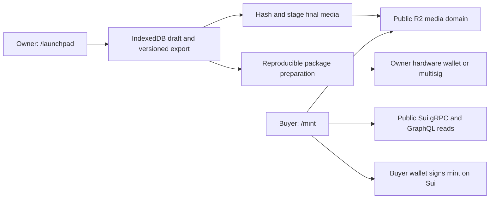

# AlphaCity launchpad overhaul — initial plan

Prepared August 31, 2026. Status: phase-1 prototype implemented locally; no purchases, production deployment, DNS change, or blockchain transaction is authorized by this document.

## 1. Recommended scope

Make `alphacity.tech/launchpad/` the local owner collection workspace and `alphacity.tech/mint/` the public mint experience. Phase 1 is explicitly for AlphaCity's own collection. Support multiple collections in the exported schema without building partner accounts, permissionless publishing, or a multi-tenant backend.

Keep Sui and the existing AlphaCity design, wallet connector, and build tooling. Keep phase 1 local: browser drafts, local file validation, explicit exports, deterministic R2 publication through a local tool, and separately reviewed wallet actions. Do not add a launchpad backend or browser-held upload credentials unless a later partner workflow creates a measured need.

The eight supplied screenshots are design references, not instructions or agreed terms. Borrow their workflow concepts, but do not copy artwork, legal text, sample collection values, TradePort's fees, royalty claims, or assurances that stages remain editable after publication. In particular, there is no requirement for a 10% fee or a $3 minimum.

Proposed first release: locally saved owner drafts; R2-hosted public media with Google Drive/local backups; fixed-price SUI minting; public and allowlist phases; per-phase wallet limits; reserved inventory; instant reveal; direct proceeds; and pause/resume. Use the existing public Sui gRPC/GraphQL services initially, with conservative polling and runtime-configurable endpoints. Delayed reveal, randomized assignment, enforced resale royalties, sponsored gas, other coins, cloud collaboration, and external creator onboarding need explicit designs before being added. A royalty percentage input is included from the start, with its actual enforcement limitations visible.

## 2. What is already present

| Area | Repository evidence | Implication |
|---|---|---|
| Public mint client | `mint/app-source.js` owns managed-drop reads and mint transactions; `coming-soon` configs remain non-transactional. | Keep `/mint/` as the only buyer route and preserve its chain-confirmation boundary. |
| Owner builder | `/launchpad/` now provides the six-step local builder with IndexedDB recovery, local file validation, phase/allowlist editing, preview, and exports. | Treat it as a local preparation tool, not authenticated cloud administration. |
| Compatibility workspace | `launchpad/operator/` retains the earlier intake/export workflow. | Keep it for compatibility while the root builder is the primary owner experience. |
| Common utilities | `shared/launchpad-core.js` handles schema v2, CSV, SUI/MIST amounts, validation, timestamp normalization, and bundle generation. | Keep browser and Node validation aligned with contract constraints. |
| Move template | `contracts/managed_drop_template/` supports supply, reserves, phases, allowlists, direct fee splitting, pausing, and publication locks. | Useful starting point; security review and production benchmarks remain necessary. |
| Preparation tooling | `scripts/launchpad-project.cjs` generates project packages and unsigned transaction batches; `scripts/launchpad-r2-publish.cjs` stages deterministic R2 releases and uploads only with `--upload`. | Keep preparation reproducible and signing/upload actions explicit. |
| Current collection | Registry contains Citizens in `coming-soon` mode without deployed package/drop IDs. | Preserve its presentation; do not assume these sample values are approved launch terms. |
| Hosting | `.github/workflows/deploy.yml` deploys the static site to GitHub Pages. An unrelated Cloudflare AI proxy already exists. | No launchpad database or upload service exists in the inspected code. Do not mix launchpad secrets into the AI proxy. |

The repository regression tests are a useful baseline, not proof of production readiness or an independent smart-contract audit. No independent audit report was established in this assessment. Live deployment parity and deployed contract state were not verified.

## 3. Routes and user experience

| Route | Purpose |
|---|---|
| `/launchpad/` | Local owner builder with browser draft persistence, local validation, preview, and explicit exports. It does not claim sign-in or cloud authorization. |
| `/launchpad/?mode=edit` | Explicit builder marker when an editor URL also needs query parameters. |
| `/mint/` | Public page for the featured collection, with a collection selector when appropriate. |
| `/mint/?collection=<slug>` | Stable shareable mint URL for a specific collection. |
| `/launchpad/operator/` | Compatibility entry into the new operator workspace. |

Old public `/launchpad/?collection=...` links conflict with the builder. The implemented migration redirects them to `/mint/?collection=...` unless `mode=edit` is present. Test trailing slashes and refreshes, and preserve `/launchpad/collections/` URLs until existing consumers migrate. Unknown collection IDs show a clear error rather than silently selecting another collection. Clean `/mint/<slug>` URLs can follow once hosting rewrites are configured.

Use six substantial steps instead of separate mostly empty screens:

1. **Collection.** Name, slug, description, creator identity, total supply, cover/banner, website, Discord, and X. Explain which fields become immutable. Keep a draft even while incomplete.
2. **Items.** Select a local folder of images plus CSV metadata. Offer a downloadable template and show traits, file matching, reserved status, and row-specific errors. Track intended supply, valid items, public supply, and reserves separately; require exact agreement before export. File contents remain in the current tab and must be reselected after reload.
3. **Mint phases.** Add, edit, reorder, or delete phases while drafting. Each has a name, public/allowlist access, SUI price, start/end or no end, per-wallet limit, and optional phase allocation. Import allowlists from CSV/TXT or pasted addresses, normalize and deduplicate, and preview eligibility. Define whether unused allocation rolls forward. An allowlist alone does not guarantee an NFT reservation.
4. **Payouts and royalties.** Specify and verify the primary-sale recipient; collect royalty percentage and recipient according to the selected royalty design. Show any actual AlphaCity primary-sale fee separately from royalties and gas. For first-party drops, propose a 0% platform fee unless a different policy is approved; do not silently inherit the existing 5% default. Primary proceeds go directly to recipient wallets, so the dashboard reports receipts rather than inventing an earnings-withdrawal balance.
5. **Review.** Show a non-transactional local approximation of the public mint, plus a plain-language summary of supply, phases, payouts, royalties, fees, network, media availability, and locked fields. Preview must not connect a wallet or broadcast transactions.
6. **Prepare.** Validate the complete package, record the immutable R2 release URL, and export editable project and prepared handoff JSON. R2 upload, package preparation, wallet approvals, and registry changes remain explicit steps outside the browser builder.

All steps autosave with visible saving/saved/error states. Include keyboard navigation, accessible labels, mobile layouts, and an unsaved-changes warning where necessary. No private key or seed phrase is ever requested.

A later post-publication milestone may add a collection management view for wallet-approved pause/resume, reserved NFT distribution, remaining reserves, confirmed mint counts, and transaction history. It is not part of the current local builder. Pending operations must remain distinct from confirmed changes, and reserved distributions must not reduce or duplicate public inventory.

The current editor shows local date/time and exports exact UTC timestamps. Before production, test daylight-saving boundary inputs and decide whether storing an explicit IANA display zone is required. Contract time controls mint eligibility: no scheduled server job is required merely to open a correctly configured phase. Define non-overlapping phases for v1 and distinguish a limit per transaction from a limit per phase or across the entire collection; the existing contract only tracks wallet usage per phase.

The buyer page shows price and total in SUI, gas as an estimate, current phase/countdown, confirmed supply, wallet eligibility and remaining allowance, quantity, and transaction progress. Handle wrong network, insufficient balance, ineligible wallet, paused/ended/sold-out state, wallet rejection, transaction failure, and stale data. Do not require CITY holdings or an admin account to browse or mint. Never report success until chain execution is confirmed; link to the receipt and received NFTs.

## 4. Technical architecture

Use a Cloudflare-hosted static frontend and public R2 bucket/custom media domain. Save the single owner's structured drafts locally in IndexedDB and keep versioned exports plus Google Drive/local backups. Use a deterministic local publication tool to hash, stage, and upload final assets through Wrangler; browser code never receives an R2 credential. Keep GitHub as source control and CI. D1, a launchpad API, partner authentication, IPFS pinning, and paid RPC are deferred until a measured need exists. This is the target architecture, not an instruction to create paid accounts now.

**Owner boundary:** the phase-1 form prepares local data and exports unsigned artifacts; it has no privileged server action to authenticate. A connected wallet or hidden page is not authorization. All actual collection administration is enforced by the on-chain AdminCap and approved through a hardware wallet or multisig. If cloud drafts/direct browser uploads or partner users are added later, introduce server-verified wallet challenges, roles, expiry/replay protection, and ownership checks before those endpoints exist.

**Data:** version collection drafts, items, phases, and allowlist entries in local storage and downloadable exports. Keep selected media as browser file handles/references where supported; require re-selection when browsers cannot persist access. Bind every prepared bundle to network, package, Drop, media manifest, and configuration hash. Keep drafts and raw allowlist files out of public static build artifacts. With the existing on-chain allowlist tables, membership is publicly inspectable; a private CSV is not a promise of private membership.

**Media publication:** the browser validates chosen local files but does not upload with embedded credentials. A local R2 tool computes hashes, stages an immutable manifest, and uploads only on an explicit command. Enforce file signature/type and size limits, safe paths, duplicate detection, and metadata limits. Do not hold a large collection in browser memory. Exclude active HTML and treat arbitrary SVG conservatively. Serve R2 through a stable `media.alphacity.tech`-style custom domain; keep an independent source backup in Google Drive/local storage and verify every URL before on-chain publication.

**Publication preparation:** run the fixed, pinned Move template through the local preparation tool or a trusted reviewed runner; never compile arbitrary user-supplied build commands. Store artifact hashes and unsigned transaction plans; private signing keys do not belong in the runner or repository. Hardware-wallet or multisig tooling approves transactions. Freeze the source snapshot once chain setup starts: current stage setup is append-only even before final publication, so later draft edits cannot silently alter a partially initialized Drop. Reconcile receipts and chain state before retries so partial success cannot create duplicate collections or inventory. Do not promise one signature for a large drop.

**Public reads:** use the chain as the authority for price, supply, phase rules, pause, and wallet usage. Cache collection configuration as static data, refresh on-chain state conservatively while visible, and recheck/simulate before signing. Start with public Sui gRPC/GraphQL endpoints and keep endpoint configuration replaceable without changing sale logic. Chain efficiency does not remove endpoint rate limits; monitor errors during rehearsal and retain a documented paid/fallback RPC switch if launch traffic proves the public service inadequate.

**Sui transport:** the repo already uses `SuiGrpcClient` and GraphQL behind a compatibility layer. Reuse and test that implementation rather than blindly replacing it. Sui's current documentation deprecates JSON-RPC and describes mainnet endpoint shutdown and further removal; verify every selected SDK, wallet, provider, and any Kiosk integration on supported transports. [Sui RPC notice](https://docs.sui.io/references/sui-api), [migration guide](https://docs.sui.io/develop/accessing-data/json-rpc-migration).

**Network separation:** introduce explicit network configuration for the launchpad rehearsal without switching unrelated production tools to testnet. Isolate package/Drop IDs, explorer links, endpoint configuration, and prepared artifacts by network. Inventory any actual deployments and capability ownership before migration; preserve existing NFTs and contracts rather than attempting to recreate them from sample configuration.

## 5. Contract decisions and production gates

- **Creator authority and collection identity:** package initialization now creates a one-time `LaunchCap`, and `create_drop` consumes it, so one package can create only one canonical Drop/NFT type. The public client also checks the configured package, Drop, economic fields, stage definitions, and setup counts before enabling mint. Keep AdminCap, DisplayCap, and UpgradeCap custody separate and documented.
- **Validation parity:** the browser and CLI now reject zero payout addresses, collections with no public inventory, duplicate allowlist entries, overlapping windows, zero-byte or spoofed media, duplicate trait keys, metadata limit violations, invalid reserve tokens, noncanonical slugs, and payment values that exceed `u64`. Re-run the same validation immediately before preparing or signing because the selected files themselves are intentionally not persisted.
- **Large collections:** the current preparation script uses 50 item calls per inventory batch. A 10,000-item collection would generate about 200 inventory transactions before other setup; full metadata also consumes on-chain storage. Benchmark realistic items, gas, object limits, signing effort, and shared-Drop contention. Adapt batch sizes to measured limits. If this proves impractical, review a batch-loading or compact commitment design before promising a production capacity.
- **Royalties:** `royalty_bps` currently records metadata; it does not enforce payment on unrestricted transfers. Either ship explicitly advisory royalties or design the required Kiosk/transfer-policy and lock flow before deploying that collection. Define resale coverage, recipient, withdrawal authority, marketplace compatibility, and transfer restrictions. Do not promise universal royalty enforcement. [Sui Kiosk example](https://docs.sui.io/onchain-finance/kiosk/kiosk-example).
- **Changes after publication:** retain locked economics, inventory, allowlists, and schedules for v1, with pause/resume available. If post-publication phase editing is required, define what can change, notice periods, immutable past usage, and permitted authority, then test and review the revised contract. The reference site's behavior is not supported by the present template.
- **Reveal and allocation:** v1 instant reveal does not imply random assignment; current inventory is publicly loaded and deterministic. Preparation requires an explicit `sequential-equivalent` attestation that every public item has equivalent mint value. If rarity or utility differs, stop and design verifiable random assignment. Delayed reveal requires protecting unrevealed media/metadata, commitments, reveal authority, recovery, and a tested transition. Hiding images in the UI is insufficient.
- **Money and custody:** SUI amounts use integer MIST; percentages use integer basis points. Confirm exact fee rounding and payout totals. Creator pays setup gas and buyers pay mint gas by default. Gas sponsorship, escrow, or custodial payouts are separate features.
- **Hard limits and reachability:** `maxPerTx` is now stored and enforced by Move. Publication requires exact stage/item/unique-allowlist counts, enough reachable stage capacity, no already-ended phase, and a final uncapped public phase with no end time; pause the Drop when the intended sale is over. This avoids permanently stranding public inventory, but it is a deliberate v1 operating rule.
- **Exact setup commitment:** the first-party release reconciles every ordered item/media URL and allowlist entry against generated deployment artifacts, while Move commits only the expected counts and immutable stage/economic fields. A same-count substitution is not detected by an on-chain content hash. Require two-person artifact/receipt review for this release; add a canonical BCS setup commitment before partner mints or less-trusted operators.
- **Capability proof:** the public config records the declared upgrade policy and capability authorities, but the client does not yet prove UpgradeCap deletion or live UpgradeCap/AdminCap/DisplayCap ownership. Record the capability object IDs and release transaction digest, inspect current ownership on-chain, and keep the mint in `coming-soon` mode until the reviewed multisig/immutability gate is complete.
- **Security:** obtain independent review of the final Move code and remediation before handling meaningful public funds. Add reproducible builds, clean deployment artifacts, R2 publication tests, spend alerts, backups/restore, monitoring, pause procedures, and incident recovery. Add API authorization and upload-abuse tests only if a later hosted or partner API is actually introduced. Audit results must identify the exact reviewed commit.

## 6. Infrastructure costs

Prices checked August 31, 2026, in USD. These are public list prices and planning estimates, not an account-specific quote. Existing shared allowances, taxes, traffic, storage retention, extra environments, and provider terms can change the bill.

**Hosting change:** GitHub Pages' published limits restrict sites primarily facilitating commercial transactions. Move the transactional frontend to suitable hosting before public launch, while retaining the repository and CI. Moving the whole domain is operationally simplest but requires staging/regression checks for the other AlphaCity tools; selective path routing is an alternative if justified. [GitHub Pages limits](https://docs.github.com/en/pages/getting-started-with-github-pages/github-pages-limits).

| Component | Small production example | Source / qualification |
|---|---:|---|
| Static frontend | $0 within the static hosting offering | [Cloudflare Pages pricing](https://developers.cloudflare.com/pages/functions/pricing/); dynamic work uses Workers allowances. |
| Draft database/API | $0 | Phase 1 uses local IndexedDB and versioned backups; no D1 or launchpad API. |
| Public media in R2 | About $0.15/month storage for 20GB | [R2 pricing](https://developers.cloudflare.com/r2/pricing/): 10GB included, then $0.015/GB-month, assuming unused free allocation; requests can add cost. Google Drive is a backup/source, not the NFT media URL. |
| IPFS pinning | $0 initially | Optional later for content-addressed redundancy; not required by the phase-1 HTTPS metadata design. |
| Sui RPC | $0 initially | Use public supported gRPC/GraphQL endpoints with conservative polling and a configurable upgrade path. A dedicated provider remains a contingency for measured traffic/rate-limit failures. |
| Logs, backups, build jobs, monitoring | May fit initial allowances; meter separately | Include storage copies, package-build CI minutes, job execution, and retention in the implementation estimate. |
| Sui publishing/setup and minting | Variable SUI, separate from hosting | Simulate realistic deployment, inventory, allowlists, and mints; show setup cost before approval. [Sui gas accounting](https://docs.sui.io/develop/transaction-payment/gas-in-sui). |
| Independent Move security review | Separate scoped quotation | No reliable flat price established. Request a quote for the final code, review depth, and remediation/retest; do not treat passing unit tests as an audit. [MoveBit audit service](https://www.movebit.xyz/). |

Example assumption: **10,000 NFTs × 2MB ≈ 20GB of original images**, before metadata, thumbnails, backups, and on-chain storage. The lean phase-1 base can remain near **$0–5/month**, depending on R2 requests and whether a Worker is later used. Reserve a **$0–55/month operating range** so a small Worker or entry paid RPC can be enabled if rehearsal/launch measurements justify it. Gas and independent security review remain separate. Recheck pricing at provisioning.

Model expected concurrent viewers and caching during testnet rehearsal. Public endpoints are the initial choice for this controlled first-party launch, with the operational risk recorded and a runtime-configurable upgrade path. [Sui RPC best practices](https://docs.sui.io/references/sui-api/rpc-best-practices).

Alternatives: Supabase Pro begins at $25/month if a Postgres-based backend is preferable; do not add it alongside D1 without a reason. Walrus is a Sui-native media option, but requires an estimate covering encoding, batching, prepaid storage duration, renewals, and gateway delivery. Neither option is necessary for the initial recommended stack. [Supabase pricing](https://supabase.com/pricing), [Walrus storage costs](https://docs.wal.app/docs/system-overview/storage-costs), [Walrus network parameters](https://docs.wal.app/docs/network-reference).

No new domain, owned blockchain node, cryptocurrency exchange integration, marketplace commission, or third-party launchpad subscription is inherently required. Existing domain renewal continues. Engineering, independent security review, and any legal review of collection terms are separate one-time work; they are not included in the monthly example. Prototype work and small testnet rehearsals can use free tiers. No paid services are needed merely to approve this plan.

## 7. Implementation sequence and acceptance criteria

| Milestone | Deliverable | Acceptance gate |
|---|---|---|
| 1. Schema and UX | Versioned collection schema, six-step draft builder, `/mint` preview, route migration, test data, and local IndexedDB draft recovery behind a persistence interface. | Implemented locally: an owner can enter launch terms, edit phases/allowlists, import items, recover structured draft fields, preview the buyer layout, and export. File contents require re-selection. Prototype only: no public deployment or mainnet signing. |
| 2. R2 media | Deterministic hash/manifest staging, explicit Wrangler upload, custom media URL, metadata validation, and backup procedure. | Credentials never enter browser/source; malformed files fail; dry-run is the default; every final URL and manifest hash verifies before preparation. |
| 3. Contract and publishing | Hardened template, pinned preparation, wallet-approved resumable setup, supply/royalty decisions implemented. | Testnet round trip works from the exported draft through the documented local CLI and explicit wallet actions to a confirmed public mint. Partial jobs recover without duplication. |
| 4. Buyer and scale checks | Shared live mint component, eligibility, fresh state, gas preview, receipts, mobile/wallet testing, and the published-collection management view. | No oversupply or bypass of time/price/limits; competing buyers and stale pages fail safely; pause/resume and reserved distribution require authorized signatures and confirmed receipts; failed execution is never shown as success. |
| 5. Review and release | Independent contract review/remediation, load test, hosting staging, monitoring, runbook, cost estimate. | Named release commit passes review; realistic capacity and costs are measured; mainnet publication and domain cutover are explicit reviewed actions. |

Meaningful tests include start/end boundary times and DST; exact MIST/basis-point rounding; phase vs global wallet caps; reserved/public supply; unauthorized admin actions and signature replay; malicious metadata; publish retries after uncertain results; gas/transaction-size limits; canonical Drop identity; sold-out races; invalid royalty assumptions; wallet/network switching; and preservation of the existing AlphaCity tools after hosting changes. Keep the current regression suite and add real integration tests rather than relying only on source-text assertions.

The immediate next milestone is **staging the deterministic R2 release, verifying its public URLs, and completing a full testnet preparation/mint rehearsal with the public Sui endpoints**. Reconcile every item and allowlist entry, capture all package/Drop/capability IDs and transaction digests, and prove the selected capability custody policy before changing the collection from `coming-soon`. Do not make a mainnet collection the first end-to-end rehearsal.

## 8. Decisions to settle before production contracts

The initial plan assumes AlphaCity-only operators, SUI payments, one fresh package and canonical Drop per collection, no primary platform fee for first-party drops, instant reveal, sequential assignment of equivalent-value public items, and locked terms after publication. Confirm or change these during implementation discovery. Specifically settle:

- First collection's actual item count, typical/max file size, expected launch concurrency, and reserved supply.
- Authorized operators, payout wallet, capability holder, and upgrade/multisig policy.
- Whether royalties must be enforceable in supported resale flows, or explicitly advisory metadata is acceptable.
- Whether randomized assignment, delayed reveal, editable future phases, or a collection-wide wallet cap are required for the first drop.
- Provider accounts, recurring budget, storage retention, and an independent security-review scope.

These decisions do not block the initial draft builder. They do block presenting a production contract, irreversible settings, or recurring spend as already approved.
